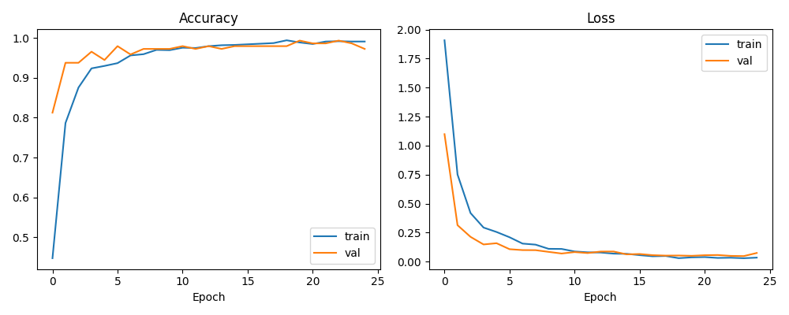
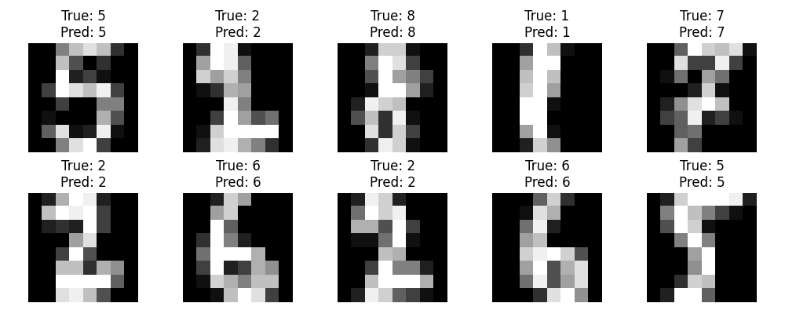

# Handwritten Digit Recognizer 🔢

A Convolutional Neural Network (CNN) that recognizes handwritten digits (0–9),
built with TensorFlow/Keras and trained on the scikit-learn digits dataset
(1,797 images of 8x8 handwritten digits — same spirit as MNIST, no external
download needed).

## 📊 Results

- **Test Accuracy: 98.06%**
- **Test Loss: 0.062**




## 🧠 Model Architecture

```
Input (8x8x1)
  → Conv2D(32, 3x3, relu)
  → MaxPooling2D(2x2)
  → Conv2D(64, 3x3, relu)
  → Flatten
  → Dense(64, relu)
  → Dropout(0.3)
  → Dense(10, softmax)
```

## 🚀 How to Run

```bash
pip install tensorflow scikit-learn matplotlib numpy
python digit_recognizer.py
```

The script will:
1. Load and normalize the digits dataset
2. Split into train/test sets (80/20)
3. Build and train a CNN for 25 epochs
4. Evaluate accuracy on the held-out test set
5. Save training curves and sample predictions as PNGs
6. Save the trained model as `digit_recognizer_model.keras`

## 🛠 Tech Stack

- Python
- TensorFlow / Keras
- scikit-learn (dataset + train/test split)
- Matplotlib (visualization)
- NumPy

## 📁 Files

- `digit_recognizer.py` — main training/evaluation script
- `training_history.png` — accuracy/loss curves
- `sample_predictions.png` — model predictions on sample test digits
- `digit_recognizer_model.keras` — saved trained model

## 💡 What I Learned

- How CNNs use convolution and pooling layers to extract spatial features from images
- How to preprocess image data (normalization, reshaping) for a CNN
- How to evaluate model performance and visualize training behavior
- How dropout helps reduce overfitting on small datasets
